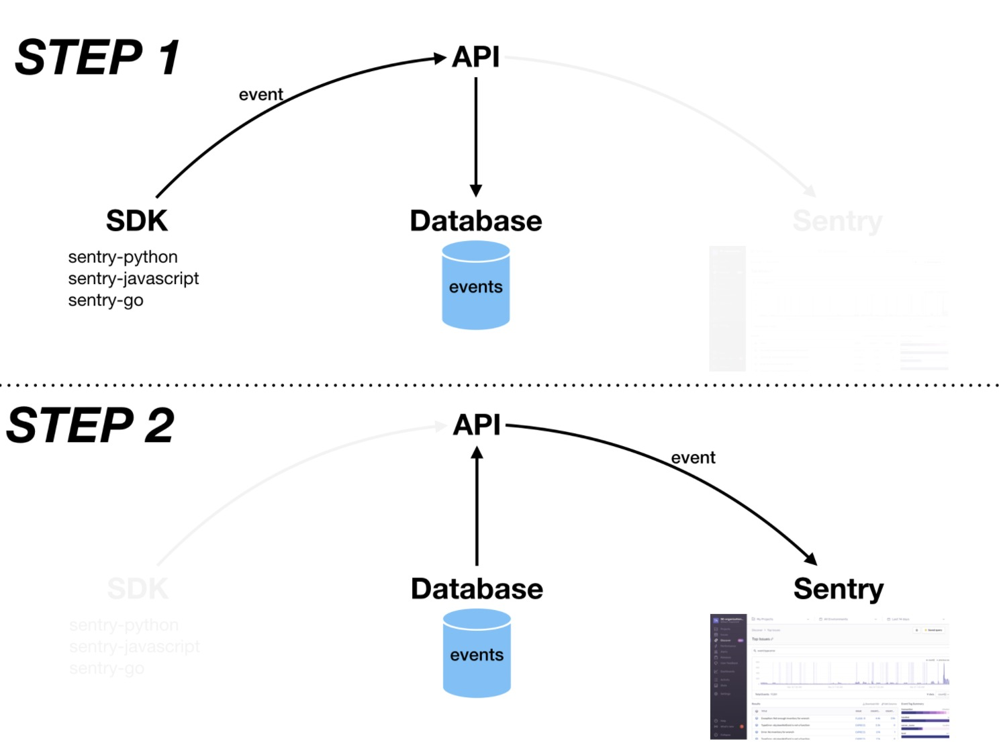

# Undertaker
## Goal
Test data automation. Have 1 app send events for all sdk's rather than 1 app per sdk. Prepare these events ahead of time in a database, by intercepting or "undertake them" on their way to Sentry using the proxy API (Flask) in this repo and storing them to sqlite.


## What's Happening
  

STEP1 - Sentry sdk's send events to the API defined in /flask/server-sqlite.py. It acts like a proxy that intercept the events before they hit Sentry. It saves copies of them in a database. This is useful because apps w/ sdk's do not have to stay running on a scheduled job to keep creating more errors and events. Events are instead saved in a database for replaying in the future.

STEP2 - Events do not have to be created because they're alread stored in a database. Load the events from the database and send them to Sentry. This can run on a scheduled job. Sentry thinks they're coming from live apps.

[example payload structure](./img/payload-structure.png) from a sentry sdk event:  

## Versions
tested on ubuntu 18.04 LTS

go version go1.12.9 linux/amd64

sentry-sdk==0.14.2

```
$ flask --version
Python 3.6.9
```

use Python3 for event-to-sentry.py or else BytesIo.getvalue() will return string instead of bytes

## Setup

1. put your DSN in `.env`

2. `pip install -r ./flask/requirements.txt`

3. `git clone getsentry/onpremise` and `install.sh`

## Run
Get proxy and Sentry running/listening:
```
# Flask
make proxy

# getsentry/onpremise
docker-compose up
```
Start sending events to the proxy and then to Sentry
```
# creates an event, hits an endpoint in Flask, saves event to database
python app.py

# script gets event from database and sends to Sentry
python event-to-sentry.py
```
See your event in Sentry at `localhost:9000`

Note - The modified `DSN` variant that you use when initializing Sentry will determine what the proxy will do. They are mapped to different endpoints in `flask/server-sqlite.py`

Note - `python sqlite-test.py` a fast way to check that your event saved in the database

## TODO
PI  
- go, send a simple error
- test go w/ sqlite
- golang scripts
- event-to-sentry.py takes an arg 'id', then decommission load-and-forward

PII  
- improve many variable names. e.g. `request.data` as `request_data_bytes`
- golang script for grabbing x events of type y from DB and send to Sentry,io
- gloang script on a crontab (macbook cronjob) every hour

PIII  
- consider package https://docs.python.org/3/tutorial/modules.html#packages
- send sentry-javascript events
- raise Exception('big problem')
- new visual
- db column for fingerprint so never end up with duplicates
- function for checking data types / classes

## Notes
https://flask.palletsprojects.com/en/1.1.x/api/  
https://requests.readthedocs.io/en/master/  
https://realpython.com/python-requests/#request-headers  

request.headers is a #dict  
request.data keys are exception, server_name, tags, event_id, timestamp, extra, modules, contexts, platform, breadcrumbs, level, sdk  

```
getsentry/sentry-python
transport.py, core_api.py, event_manager.py
```

Working Request Headers
```
{
    'Host': 'localhost:3001',
    'Accept-Encoding': 'identity', 
    'Content-Length': '1501', 
    'Content-Encoding': 'gzip', 
    'Content-Type': 'application/json', 
    'User-Agent': 'sentry.python/0.14.2'
}
```

```
type(request) <class 'werkzeug.local.LocalProxy'>
type(request.headers) <class 'werkzeug.datastructures.EnvironHeaders'>
type(request.data) <class 'bytes'>
200 RESPONSE and event_id b'{"id":"2e8e7ab795ed4f9fb70d172aa2b79815"}'

print('request.headers', request.headers) (K | V line separated)
print('type(request.data)', type(request.data)) # <class 'bytes'>
```

replaying the payload many times. grpc

MemoryView  
https://www.postgresql.org/message-id/25EDB20679154BDBB3CBBD335184E1D7%40frank  
https://www.postgresql.org/message-id/C2C12FD0FCE64CE8BB77765A526D3C73%40frank  

"Q. How to save a instance of a Class to the DB?"
"A. You can't store the object itself in the DB. What you do is to store the data from the object and reconstruct it later."
https://stackoverflow.com/questions/2047814/is-it-possible-to-store-python-class-objects-in-sqlite

you may have to `sudo service postgresql stop` to free up 5432 on your machine

Troubleshoot - compare len(bytes) on the way in as when it came out...

If you think you messed up your database, delete database.db and re-create the file, run db_prep again to set the schema on it.

{\"exception\": 
    {
        \"values\":
         [{\"stacktrace\": 
            {\"frames\": []},
             \"type\": \"Exception\", \"value\": \"ooooooo\", \"module\": \"exceptions\", \"mechanism\": null}]
    }, 
    \"server_name\": \"pop-os\", \"level\": \"error\",
    \"event_id\": \"d00a16bf0c2a485283c82c2f962835bb\",
     "timestamp\": \"2020-03-30T03:47:37.000588Z\", 
     \"extra\": {\"sys.argv\": [\"app.py\"]}, \"modules\": {\"pandocfilters\": \"1.4.2\", \"ipython-genutils\": \"0.2.0\", \"oauth\": \"1.0.1\", \"attrs\": \"19.3.0\", \"pyparsing\": \"2.4.0\", \"keyrings.alt\": \"3.0\", \"jupyterlab-launcher\": \"0.11.2\", \"lazr.uri\": \"1.0.3\", \"flask\": \"1.1.1\", \"send2trash\": \"1.5.0\", \"dotenv\": \"0.0.5\", \"itsdangerous\": \"1.1.0\", \"prometheus-client\": \"0.7.1\", \"pathlib2\": \"2.3.5\", \"backports.shutil-get-terminal-size\": \"1.0.0\", \"python\": \"2.7.17\", \"secretstorage\": \"2.3.1\", \"markupsafe\": \"1.1.1\", \"jinja2\": \"2.11.1\", \"httplib2\": \"0.9.2\", \"bleach\": \"3.1.1\", \"decorator\": \"4.4.2\", \"contextlib2\": \"0.6.0.post1\", \"jupyter-client\": \"5.3.4\", \"wadllib\": \"1.3.2\", \"psutil\": \"5.4.2\", \"cycler\": \"0.10.0\", \"jsonschema\": \"3.2.0\", \"ipywidgets\": \"7.5.1\", \"kiwisolver\": \"1.1.0\", \"sentry-sdk\": \"0.14.2\", \"ptyprocess\": \"0.6.0\", \"importlib-metadata\": \"1.5.0\", \"qtpy\": \"1.9.0\", \"werkzeug\": \"1.0.0\", \"qtconsole\": \"4.7.0\", \"olefile\": \"0.45.1\", \"entrypoints\": \"0.3\", \"blinker\": \"1.4\", \"gunicorn\": \"19.10.0\", \"matplotlib\": \"2.2.4\", \"ipython\": \"5.9.0\", \"zipp\": \"1.2.0\", \"pickleshare\": \"0.7.5\", \"mistune\": \"0.8.4\", \"nbformat\": \"4.4.0\", \"pyxdg\": \"0.25\", \"wcwidth\": \"0.1.8\", \"wsgiref\": \"0.1.2\", \"traitlets\": \"4.3.3\", \"terminado\": \"0.8.3\", \"requests\": \"2.18.4\", \"defusedxml\": \"0.6.0\", \"simplegeneric\": \"0.8.1\", \"pillow\": \"5.1.0\", \"asn1crypto\": \"0.24.0\", \"pygobject\": \"3.26.1\", \"pygments\": \"2.5.2\", \"jupyter-console\": \"5.2.0\", \"prompt-toolkit\": \"1.0.18\", \"pexpect\": \"4.8.0\", \"backports-abc\": \"0.5\", \"powerline-status\": \"2.6\", \"typing\": \"3.7.4.1\", \"python-dotenv\": \"0.12.0\", \"testpath\": \"0.4.4\", \"certifi\": \"2018.1.18\", \"numpy\": \"1.16.4\", \"pyzmq\": \"19.0.0\", \"sqlalchemy\": \"1.3.15\", \"simplejson\": \"3.13.2\", \"widgetsnbextension\": \"3.5.1\", \"subprocess32\": \"3.5.4\", \"powerline-shell\": \"0.7.0\", \"pytz\": \"2019.1\", \"jupyter-core\": \"4.6.3\", \"functools32\": \"3.2.3.post2\", \"python-dateutil\": \"2.8.1\", \"jupyterlab\": \"0.33.12\", \"pycrypto\": \"2.6.1\", \"pyrsistent\": \"0.15.7\", \"chardet\": \"3.0.4\", \"setuptools\": \"44.0.0\", \"flask-cors\": \"3.0.8\", \"configobj\": \"5.0.6\", \"ipykernel\": \"4.10.1\", \"zope.interface\": \"4.3.2\", \"backports.functools-lru-cache\": \"1.5\", \"singledispatch\": \"3.4.0.3\", \"pip\": \"20.0.2\", \"configparser\": \"4.0.2\", \"cryptography\": \"2.1.4\", \"six\": \"1.14.0\", \"click\": \"7.1.1\", \"nbconvert\": \"5.6.1\", \"lazr.restfulclient\": \"0.13.5\", \"webencodings\": \"0.5.1\", \"wheel\": \"0.30.0\", \"tornado\": \"5.1.1\", \"urllib3\": \"1.22\", \"notebook\": \"5.7.8\", \"ipaddress\": \"1.0.23\", \"launchpadlib\": \"1.10.6\", \"argparse\": \"1.2.1\", \"jupyter\": \"1.0.0\", \"bzr\": \"2.8.0.dev1\", \"psycopg2-binary\": \"2.8.4\", \"enum34\": \"1.1.9\", \"futures\": \"3.3.0\", \"keyring\": \"10.6.0\", \"pyopenssl\": \"17.5.0\", \"idna\": \"2.6\", \"nltk\": \"3.4.3\", \"scandir\": \"1.10.0\"}, \"contexts\": {\"runtime\": {\"version\": \"2.7.17\", \"name\": \"CPython\", \"build\": \"2.7.17 (default, Nov  7 2019, 10:07:09) \\n[GCC 7.4.0]\"}}, \"platform\": \"python\", \"breadcrumbs\": [], \"sdk\": {\"version\": \"0.14.2\", \"name\": \"sentry.python\", \"packages\": [{\"version\": \"0.14.2\", \"name\": \"pypi:sentry-sdk\"}], \"integrations\": [\"argv\", \"atexit\", \"dedupe\", \"excepthook\", \"logging\", \"modules\", \"stdlib\", \"threading\"]
     }
}

```
MODIFIED_DSN_SAVE = ''.join([KEY,'@',SENTRY,'/3'])
MODIFIED_DSN_SAVE = '{KEY}@{PROXY}/3'.format(KEY=KEY,PROXY=PROXY)
```