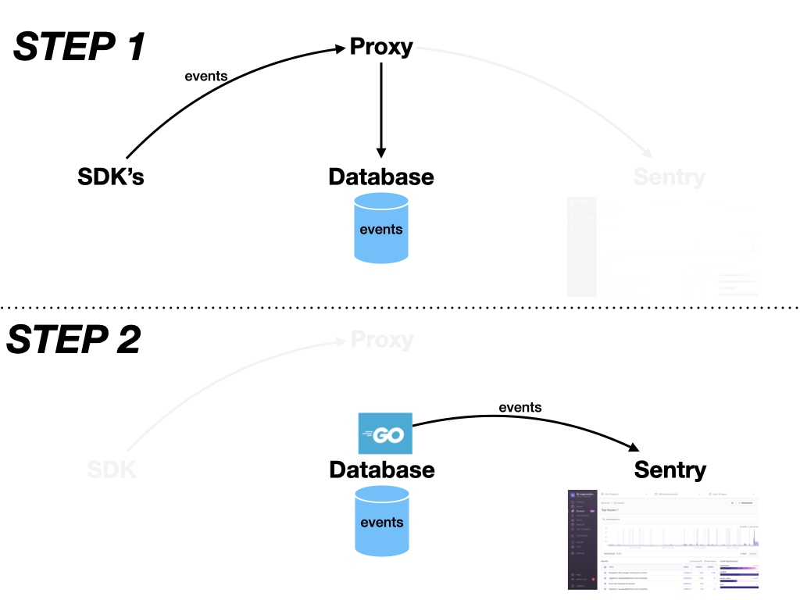

<!--  -->
# The Undertaker

  

## why and what's happening?  
Good for test data automation. Do not have to maintain +10 different app and sdk types in Heroku/GCP sending events all the time. Rather, run a single program `event-to-sentry.go` on a cronjob to send those +10 event types for you. It's free. 

  

**STEP1**  
`event.py` creates sdk events

`flask/proxy.py` undertakes (intercepts) events on their way to Sentry and saves them in sqlite

**STEP2**  
`event-to-sentry.go` loads events from sqlite and sends them to Sentry, without using an sdk.

## Setup

1. Enter your DSN's in `.env`  
Both the proxy.py and event-to-sentry.go will use this.
DSN's from `getsentry/onpremise` do not support transactions as of 07/01/20
```
// go build -o bin/event-to-sentry-toolstore *.go
DSN_JAVASCRIPT_SAAS
DSN_PYTHON_SAAS
```
or
```
// go build -o bin/event-to-sentry-tracing-example *.go
DSN_PYTHON_GATEWAY
DSN_PYTHON_DJANGO
DSN_PYTHON_CELERY
```
2. `pip3 install -r ./python/requirements.txt` for the proxy
3. `go build -o bin/event-to-sentry-toolstore *.go` or `go build -o bin/event-to-sentry-tracing-example *.go` depending on DSN's in .env

## Run
Get your proxy and Sentry instance running first.
```
make proxy

# cd getsentry/onpremise
docker-compose up
```
**STEP1**  
Send events to proxy... 
```
# optional
python3 event.py
```
**STEP2**  
```
go build -o bin/event-to-sentry *.go
./bin/event-to-sentry
./bin/event-to-sentry --id=<id>
./bin/event-to-sentry --id=<id> -i
./bin/event-to-sentry --all

go build -o bin/event-to-sentry-<name> *.go
./bin/event-to-sentry-<name>

```
See your event in Sentry at `localhost:9000`

**Cronjobs**  
Cronjob on Macbook that sends events in the background
`crontab -e` to open up your Mac's crontab manager
```
# every minute
1-59 * * * * cd /Users/wcap/thinkocapo/undertaker && ./bin/event-to-sentry --all
1-59 * * * * cd /<path>/<to>/undertaker/ && ./event-to-sentry

# every minute, every day of the week M-F
# * * * * 1-5 cd /Users/wcap/thinkocapo/undertaker && ./bin/event-to-sentry --all
# * * * * 1-5 cd /<path>/<to>/undertaker/ && ./event-to-sentry --all

# every 5 minutes
# */5 * * * 1-5 cd /Users/wcap/thinkocapo/undertaker && ./bin/event-to-sentry-neil --all
# */5 * * * 1-5 cd /<path>/<to>/undertaker/ && ./event-to-sentry --all

# crontab -l, to list cronjobs
```

https://crontab.guru/

## Notes
See `python/event.py` for how to construct the 3 'MODIFIED' DSN types which decide which of the 3 endpoints in `proxy.py` which you can hit. Use any app+sdk with one of these MODIFIED_DSN's following the convention in proxy.py

`python3 test/db.py` is for showing total row count and most recent event.  
`python3 test/db.py 5` gets the 5th item  
`python3 test/dby.py 5 -b` gets the 5th item and prints its body  

The timestamp from `go run event-to-sentry.go` is sometimes earlier than today's date

Borrowed code from: getsentry/sentry-python, getsentry/sentry-go, goreplay

https://develop.sentry.dev/sdk/store for info on the Sentry store endpoint

https://develop.sentry.dev/sdk/event-payloads/ for what a sdk event looks like. Here's [/img/example-payload.png](./img/example-payload.png) from javascript

6 events in the am-transactions-sqlite.db was 57kb
19 events tracing-example was 92kb

To use with getsentry/tracing-example, serve the python/proxy.py via `ngrok http 3001` and put the ngrok address in tracing-example's .env like:  
`SENTRY_DSN=https://1f2d7bf845114ba6a5ba19ee07db6800@5b286dac3e72.ngrok.io/3`

tested on: ubuntu 18.04 LTS, go 1.12.9 linux/amd64, sentry-sdk 0.14.2, flask Python 3.6.9

use python3 or else else `getvalue()` in `event-to-sentry.py` returns wrong data type ¯\_(ツ)_/¯

`python-dotenv` vs `dotenv`

## Todo
- pass a DSN's file at run-time, consider db too

- Mobile android errors/crashes/sessions
- update tracing-example's endpoint names. www.toolstoredmeo.com instead of gcp url


sentry-cli releases -o testorg-az new -p proxy 0.0.2

sentry-cli releases -o testorg-az -p proxy set-commits --local 0.0.2


