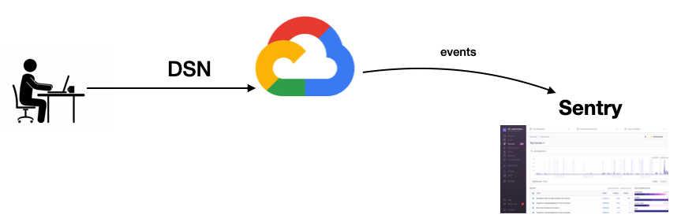

<!--  -->
# The Undertaker
The Undertaker is an event traffic replay service. Re(p)lay

  

## Why?  
Stop maintaing +10 different platform SDK's in GCP sending events all the time. Rather, run a single program `event-to-sentry.go` on a cronjob to send all those events for you. It's free. Great for automating test data. Run this command to try out the cloud hosted script:
```
curl \
    -H "dsn1: <YOUR_JAVASCRIPT_DSN>" \
    -H "dsn2: <YOUR_PYTHON_DSN>" \
    -H "data: sentry-demos-tracing.json" \
    -H "tag: ishere" \
    https://<country>-<region>-<gcp_project>.cloudfunctions.net/<cloud_function>
```

  

**STEP 1**  
SDK's create events and `python/proxy.py` intercepts "undertakes" the events on their way to Sentry and saves them in sqlite

**STEP 2**  
`event-to-sentry.go` loads the events from sqlite and relpays them to Sentry (no sdk's used in this step)

## Setup (Local)

1. Enter your DSN's in `.env`  
```
// for the Tool Store data set
DSN_JAVASCRIPT_SAAS=
DSN_PYTHON_SAAS=

or

// for the Gateway/Microservices/Celery dataset
DSN_PYTHON_GATEWAY=
DSN_PYTHON_DJANGO=
DSN_PYTHON_CELERY=

// set this here as your default or pass it at runtime using --db
SQLITE=
```

2. `pip3 install -r ./python/requirements.txt` for the proxy  
3.

```
go build -o bin/event-to-sentry-<name> *.go

// for Tool Store data set (javascrip, pythont, errors+transactions)
go build -o bin/event-to-sentry-toolstore

// for Gateway/Microservices/Celery dataset (python transactions)
go build -o bin/event-to-sentry-tracing-example *.go
```

Note - Transactions are not supported if using DSN's from `getsentry/onpremise` as of 07/08/20

## Run Locally
```
./bin/event-to-sentry-<name>
./bin/event-to-sentry
./bin/event-to-sentry --id=<id>
./bin/event-to-sentry --id=<id> -i
./bin/event-to-sentry --all
```
or use `--js` `--py` to pass DSN's when running the executable
```
./bin/event-to-sentry --all --db=am-transactions-timeout-sqlite.db
./bin/event-to-sentry --all --db=<path_to_.db> --js=<javascripti_DSN> --py=<python_DSN>
```

See your events in Sentry

## Run in Cloud Function
```
curl \
    -H "dsn1: <YOUR_JAVASCRIPT_DSN>" \
    -H "dsn2: <YOUR_PYTHON_DSN>" \
    -H "data: sentry-demos-tracing.json" \
    -H "tag: ishere" \
    https://$UNDERTAKER_CLOUD_FUNCTION_URL
```

## Proxy (optional)
Use the proxy if you want to create your own data set 

1. Get your proxy running
```
make proxy
```

2. Modify your app's DSN so it will point to the proxy. See [python/event.py](./python/event.py) for how to do this.

3. Create errors in your app, so the events get sent to the proxy.

4. Check your events saved to the database
`python3 test/db.py` or `make testdb`

If your apps are in a VPC/network that you can't run the proxy inside of, then you can expose the proxy's port 3001 via ngrok
1. `ngrok http 3001`
2. put the ngrok address in your app's DSN like:  
`SENTRY_DSN=https://1f2d7bf845114ba6a5ba19ee07db6800@5b286dac3e72.ngrok.io/3`
3. now your events will send to the proxy

## Cronjobs
Macbook's cronjob manager for sending events in the background while you work
```
# crontab -l, to list cronjobs
# crontab -e to open crontab manager

# every minute
1-59 * * * * cd /<path>/<to>/undertaker/ && ./event-to-sentry

# every minute, every day of the week M-F
# * * * * 1-5 cd /<path>/<to>/undertaker/ && ./event-to-sentry-<name> --all

# every 5 minutes
*/5 * * * 1-5 cd /<path>/<to>/undertaker/ && ./event-to-sentry-<name> --all
```

https://crontab.guru/

## Cloud
  

**Upload Dataset to Cloud Storage**
Contact administrator

**Deploy Cloud Function**
Make sure it compiles locally first `go build -o ignore *.go`

Optionally run it as a local client (see client.go)

```
cd api // ignore-event-to-sentry.go
gcloud functions deploy <name> --runtime go113 --trigger-http --set-env-vars BUCKET=<bucket>
gcloud functions describe <name>  
gsutil ls -r gs://<bucket>/
```

**Calling the Cloud Function**
```
curl \
    -H "dsn: <dsn_python>" \
    -H "data: <name.json>" \
    https://<country>-<region>-<gcp_project>.cloudfunctions.net/<cloud_function>

curl \
    -H "dsn1: <dsn_javasc>" \
    -H "dsn2: <dsn_python>" \
    -H "data: <name.json>" \
    https://<country>-<region>-<gcp_project>.cloudfunctions.net/<cloud_function>
```

https://cloud.google.com/go/docs/setup  
https://cloud.google.com/functions/docs/quickstart (gcloud cli)  
https://cloud.google.com/functions/docs/quickstart#whats-next  
https://cloud.google.com/functions/docs/writing/specifying-dependencies-go  
"go mod tidy"


## Notes

#### database
`python3 test/db.py` shows total event count and most recently saved event.  
`python3 test/db.py 5` gets the 5th event  
`python3 test/dby.py 5 -b` gets the 5th event and prints its body  

6 events in the am-transactions-sqlite.db was 57kb  
19 events tracing-example was 92kb

#### gotcha's
The timestamp from `go run event-to-sentry.go` is sometimes earlier than today's date and time 

Use python3 or else else `getvalue()` in `python/event-to-sentry.py` returns wrong data type

#### other
Borrowed code from: getsentry/sentry-python, getsentry/sentry-go, getsentry/gor-middleware, goreplay

https://develop.sentry.dev/sdk/store for info on the Sentry store endpoint

https://develop.sentry.dev/sdk/event-payloads/ for what a sdk event looks like. Here's an [example-payload.png](./img/example-payload.png) from javascript

Tested on ubuntu 18.04 LTS, go 1.12.9 linux/amd64, sentry-sdk 0.14.2, flask Python 3.6.9

`python-dotenv` vs `dotenv` if os.getenv is failing

`export PYTHONWARNINGS="ignore:Unverified HTTPS request"` before make proxy  
try saving request.data without decompressing first

if the request has "application/x-sentry-envelope" then store endpoint knows to treat it as a Envelope

Google Cloud SDK 303.0.0

initialize your file.json to an empty array [] because it gets appended to

## Todo
DONE saas it
DONE sentry-cli integration w/ source maps
DONE timestamps,
    w/ randomizations
    - js /toolstores Resources appear too early, and 'toolsreceived' didn't line up. But may poor looking Tx's/spans w/out undertaker as well.
    - js checkout 'processing shopping cart result' appears both early and late
    - py get_tools 'connect to db' overlaps 'run query', 'format results' can appear early
    - py checkout GOOD
    w/out randomization SELECTED

DONE event-to-sentry.go w/ Cloud Storage for the json
DONE event-to-sentry.go in Cloud Function
- cloud scheduler the Cloud Function (undo ignore-event-to-sentry.go)

- sentry-cli CalVer releases from Macbook once a week, for now
#### future
- sentry-cli from cloud scheduler (Cloud Run Service)

Cronjob for 5,000/hr (3.6million for 30 days)

Refactor:  
Item interface{} as Item struct? Timestamp type for start_timestamp/timestamp.

Test Mobile Envelopes 
Test Mobile Sessions

./go.mod, ./api/go.mod  